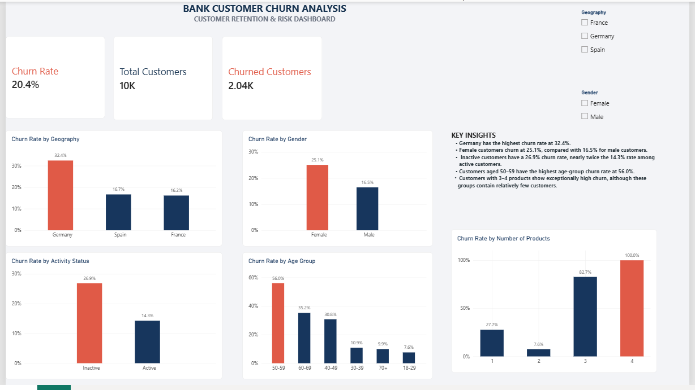
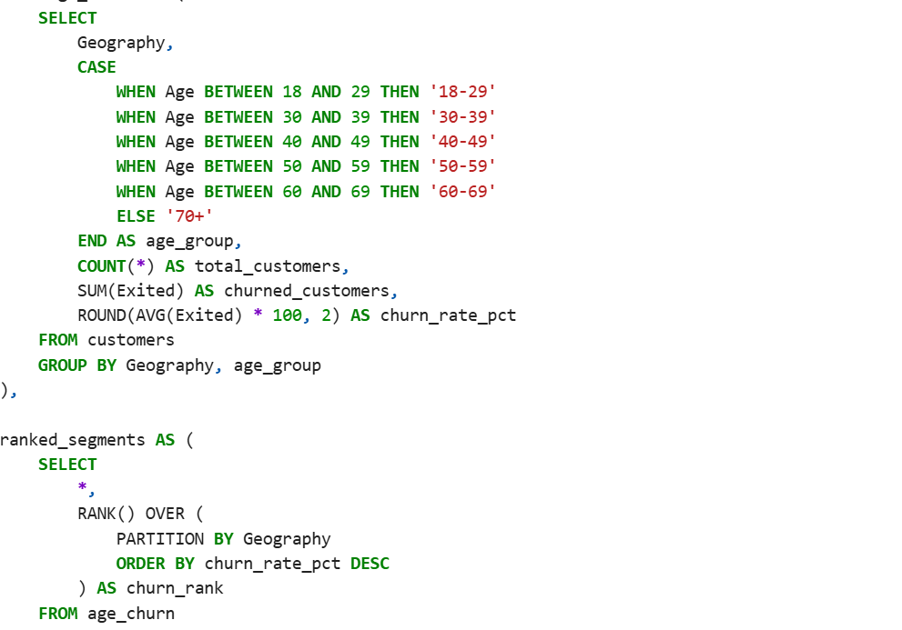
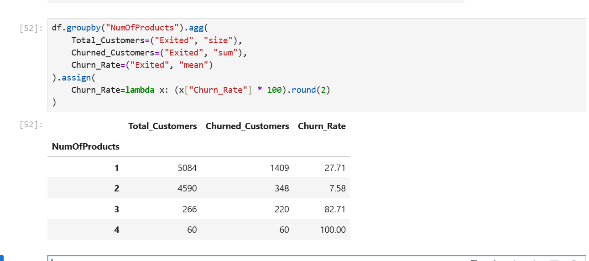

# Bank Customer Churn Analysis

## Project Overview

This project analyzes bank customer churn to identify the key characteristics and behavioral patterns associated with customers leaving the bank.

The analysis uses SQL and Python for data exploration and validation, while Power BI is used to create an interactive dashboard that presents the main churn trends and business insights.

The project demonstrates an end-to-end data analytics workflow, including data preparation, exploratory analysis, SQL querying, Python analysis, DAX measures, data visualization, and business insight generation.

## Dashboard Preview


## Tools & Technologies

- **SQL** – Data exploration, aggregation, segmentation, CTEs, and window functions
- **Python (Pandas)** – Data cleaning, exploratory data analysis, validation, and churn analysis
- **Power BI** – Data modeling, DAX measures, interactive visualization, and dashboard development
- **Jupyter Notebook** – Python analysis and documentation
- **Visual Studio Code** – Project organization and documentation
## Dataset

The dataset contains information on 10,000 bank customers and includes demographic, financial, and account-related attributes used to analyze customer churn.

Key fields include:

- Credit score
- Geography
- Gender
- Age
- Tenure
- Account balance
- Number of products
- Credit card ownership
- Active membership status
- Estimated salary
- Exited (churn indicator)

The `Exited` field is used as the target variable, where `1` represents a customer who churned and `0` represents a customer who remained with the bank.
## Key Business Questions

The analysis focuses on the following questions:

1. What is the overall customer churn rate?
2. How does churn vary across different geographic markets?
3. Is customer churn associated with gender?
4. How does customer activity status relate to churn?
5. Which age groups have the highest churn rates?
6. How does the number of products held by a customer relate to churn?
## Key Findings

- The overall customer churn rate is approximately **20.4%**.
- **Germany** has the highest churn rate at approximately **32.4%**, compared with Spain and France at about 16%.
- **Female customers** have a higher churn rate (**25.1%**) than male customers (**16.5%**).
- **Inactive customers** have a substantially higher churn rate (**26.9%**) than active customers (**14.3%**).
- Customers aged **50–59** have the highest churn rate among the age groups analyzed, at approximately **56.0%**.
- Customers with **3 products** have a churn rate of approximately **82.7%**, while customers with **4 products** show a **100%** churn rate in this dataset.
- The 3-product and 4-product groups contain relatively few customers, so their exceptionally high churn rates should be interpreted with caution.
## Predictive Modelling

Two classification models were developed to predict customer churn:

- **Logistic Regression** – used as an interpretable baseline model
- **Random Forest** – used to capture more complex and non-linear relationships

Categorical variables were one-hot encoded, while numerical features were standardized as part of the preprocessing pipeline. The dataset was split into training and test sets using an 80/20 split with stratification on the churn target.

### Model Performance

| Model | Accuracy | Precision | Recall | F1 Score | ROC-AUC |
|---|---:|---:|---:|---:|---:|
| Logistic Regression | 71% | 39% | 70% | 50% | 0.777 |
| Random Forest | 85% | 63% | 60% | 61% | 0.853 |

Random Forest demonstrated stronger overall discrimination, precision, and F1-score, while Logistic Regression identified a larger proportion of actual churners through its higher recall.

The results illustrate an important business trade-off: a retention strategy focused on identifying as many potential churners as possible may prioritize recall, while a strategy seeking to reduce unnecessary retention interventions may place greater emphasis on precision.

Model feature importance was also examined to understand which variables contributed most to the Random Forest predictions. These importance values represent predictive contribution and should not be interpreted as evidence of causation.
## SQL Analysis

SQL was used to independently investigate and validate the main churn patterns identified during the analysis.

## SQL Analysis

SQL was used to independently investigate and validate the main churn patterns identified during the analysis.

The SQL analysis includes:

- Overall customer churn calculations
- Churn analysis by geography and activity status
- Age-group segmentation using `CASE` statements
- Product-level churn analysis
- Multi-variable customer segmentation
- Filtering aggregated segments using `HAVING`
- Common Table Expressions (CTEs)
- Window functions for ranking churn segments within geographic markets

### SQL Example


## Python Analysis

Python and Pandas were used for data preparation, exploratory data analysis, customer segmentation, visualization, and validation of the churn patterns.

The analysis examined relationships between churn and variables including:

- Geography
- Gender
- Age
- Account balance
- Credit score
- Tenure
- Number of products
- Active membership status
- Credit card ownership
- Estimated salary

The exploratory analysis was also used to investigate interactions between customer characteristics, including geography and activity status, age and activity status, and product holdings and activity status.

### Python Analysis Example


## Business Recommendations

Based on the analysis, the bank could consider the following actions:

- Prioritize retention monitoring for customer segments showing elevated churn, particularly customers in Germany and inactive customers.
- Investigate the customer experience and product structure associated with customers holding three or four products, while recognizing the relatively small size of these groups.
- Develop targeted engagement strategies aimed at increasing activity among inactive customers.
- Examine the needs and experiences of customers aged 50–59, who recorded the highest churn rate among the age groups analyzed.
- Use churn prediction scores to support proactive retention campaigns, with decision thresholds selected according to the business cost of missed churners versus unnecessary interventions.
- Continue monitoring churn patterns over time to determine whether the identified relationships remain consistent with new customer data.
## Project Structure

```text
Project_02/
│
├── data/          # Dataset used for the analysis
├── images/        # Dashboard, SQL, and Python screenshots
├── notebooks/     # Jupyter Notebook analysis and modelling
├── powerbi/       # Power BI dashboard file
├── sql/           # SQL analysis queries
└── README.md      # Project documentation
```
## Conclusion
This project demonstrates an end-to-end customer churn analysis using SQL, Python, machine learning, and Power BI.

The analysis identified meaningful differences in churn across geography, gender, activity status, age groups, and product holdings. Predictive modelling was then used to evaluate how customer characteristics could be combined to identify customers at greater risk of churn.

The final Power BI dashboard translates these findings into an accessible business-facing view, while the SQL and Python components provide the analytical foundation behind the insights.

Overall, the project demonstrates skills in data preparation, exploratory data analysis, SQL, Python, predictive modelling, DAX, data visualization, and communicating analytical findings for business decision-making.
## Author

**[Mark Oliver Erbynn Baidoo ]**  
Data Analyst

This project was developed as part of my data analytics portfolio to demonstrate practical skills in SQL, Python, machine learning, Power BI, and business-focused data analysis.
